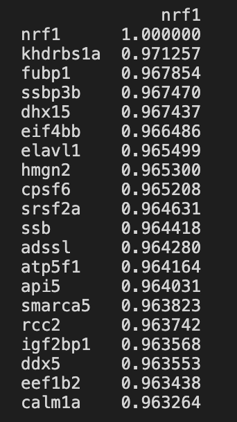

## Pearson's Correlation

**Libraries to Import**
```python
import pandas as pd
import scipy
from sklearn.metrics.pairwise import euclidean_distances
from scipy.stats import pearsonr
from scipy.spatial.distance import pdist, squareform
import numpy as np
import matplotlib.pyplot as plt
from matplotlib.colors import rgb2hex, colorConverter
from mpl_toolkits.mplot3d import Axes3D
import seaborn as sns
```

**Import Tomo-seq 10 data file and manipulate into Pandas DataFrames for use**
- Readin Input File

```python
# Open File to Process
rawdata = pd.read_table("TomoZF10ss.csv",delimiter = ',')
```

- Manipulate Input for future processing

```python
# Import external data
# convert data type

# Mapping ENSEMBL back to GENE name to help label and search operations 
gene_mapping = rawdata
gene_mapping.index = gene_mapping['ENSEMBL']
gene_mapping = gene_mapping[gene_mapping.columns[1:2]]
gene_mapping = gene_mapping.fillna(0)

# now loop through the mapping and convert any gene names = 0 to the ensemble
for row_num, value in enumerate(gene_mapping.index.values):
    if(gene_mapping.iloc[row_num][0]==0):
        gene_mapping.iloc[row_num,0] = value 
    
# set index
rawdata.index = rawdata['ENSEMBL'] 
rawdata = rawdata.drop(['ENSEMBL','gene','name'], axis=1)

# Have to drop Rows where the Gene name aka(index) is Blank
# data = data.loc[data.index.dropna(how='all')]
# To Follow Spactial DB we convert NaN to 0
rawdata = rawdata.fillna(0)

# need to capture row 0 into a list for mapping later as column names
section_map = rawdata.columns.tolist()
```
- Breakout AP, VD and LR data Axis

```python
data = rawdata[rawdata.columns[0:51]]
APdata = rawdata[rawdata.columns[0:52]]
LRdata = rawdata[rawdata.columns[52:104]]
VDdata = rawdata[rawdata.columns[104:156]]

# Rename Columns so they align for future plotting.
LRdata.columns=APdata.columns
VDdata.columns=APdata.columns

#Remove Duplicate Columns
APdata = APdata.loc[:,~APdata.columns.duplicated()]
LRdata = LRdata.loc[:,~LRdata.columns.duplicated()]
VDdata = VDdata.loc[:,~VDdata.columns.duplicated()]
```

**Calculate the Pearson Correlation from the complete data set
```python
### Create Pearson Correlation 
rawdataT = rawdata.T
pairwise = rawdataT.corr()
pairwise.columns = gene_mapping['gene'].to_list()
pairwise.index = gene_mapping['gene'].to_list()

# Specify Gene to look at
geneID = "nrf1"
temp = pairwise[[geneID]]
temp = temp.sort_values(by=geneID,ascending=False)
print(temp.head(n=20))
```
Results
<div> </div>

**Plot Single Gene across all 3 axis
```python
# Generate LinePlot to compare with SpatialDB
ensemblID = gene_mapping.loc[gene_mapping['gene']==geneID]

# Need to build dataframe from AP, LR and VD dataframes to use for Multi-Line plot
lineDF = pd.DataFrame(columns=APdata.columns)
lr1 = pd.DataFrame(columns=APdata.columns)
vd1 = pd.DataFrame(columns=APdata.columns)
lensemb_value=ensemblID.index.values

# Find gene in each of the 3 DataFrames
lineDF=lineDF.append(APdata.loc[geneID,:],ignore_index=True)
lr1=lr1.append(LRdata.loc[geneID,:],ignore_index=True)
vd1=vd1.append(VDdata.loc[geneID,:],ignore_index=True)

# Now append results into 1 DataFrame
lineDF=lineDF.append(lr1,ignore_index=True)
lineDF=lineDF.append(vd1,ignore_index=True)

# Transpose ne DataFrame
lineDFT = lineDF.T

# Set Labels
lineDFT.columns=['AP-'+geneID,'LR-'+geneID,'VD-'+geneID]

# Set frequency of x tick marks
p=0
xticks_label = pd.DataFrame(columns=['label'])
for col_num, value in enumerate(lineDFT.index.values):
    if(col_num%2):
        xticks_label.loc[p] = [value]
        p=p+1
        
# Set Tick Labels        
label_list = [1,3,5,7,9,11,13,15,17,19,21,23,25,27,29,31,33,35,37,39,41,43,45,47,49,51]
markers=['o','d','s']
lineDFT.plot(figsize=(20,10),grid=True,xticks=label_list,color=["blue","green","red"],marker='o', ylabel="Expression Levels")
plt.show()
```
Image
<div> </div>

**Plot Top 10 Associated genese by distance By Section**
- Code is replicated for each axis AP, LR and VD

```python
# Generate LinePlot to compare with SpatialDB
plotlist = temp.index.to_list()
plotgenes = plotlist[:10]

# Loop through list and build data for line plot
i = 0
APdata.index = gene_mapping['gene'].to_list()

APdataT = APdata.T
lineDF = pd.DataFrame(columns=APdata.columns)

while i < 10:
    geneID = plotgenes[i]
    lineDF = lineDF.append(APdata.loc[geneID],ignore_index=False)
    i = i+1    

# Transpose ne DataFrame
lineDFT = lineDF.T
# Remove Duplicate Columns
lineDFT = lineDFT.loc[:,~lineDFT.columns.duplicated()]
# Set Labels
lineDFT.columns=plotgenes

# Set frequency of x tick marks
p=0
xticks_label = pd.DataFrame(columns=['label'])
for col_num, value in enumerate(lineDFT.index.values):
    if(col_num%2):
        xticks_label.loc[p] = [value]
        p=p+1
        
# Set Tick Labels        
label_list = [1,3,5,7,9,11,13,15,17,19,21,23,25,27,29,31,33,35,37,39,41,43,45,47,49,51]
lineDFT.plot(figsize=(20,10),grid=True,xticks=label_list, marker='o', ylabel="Expression Levels",title="fgf17 Cluster Expression Levels on AP")
plt.show()
```
<table style="width:100%">
  <tr>
    <th>AP Image</th>
    <th>LR Image</th>
  </tr>
  <tr>
    <td><div> </div></td>
    <td><div> </div></td>
  </tr>
  <tr>
    <td>"VD Image"</td>
  </tr>
  <tr>
    <td><div> </div></td>
  </tr>
</table>

**Generate Heatmaps of the Top 10 Associated genese by distance By Section**
- Code is replicated for each axis AP, LR and VD
- The following Function will convert the Decimal Normalized data 1-10 to 0 to 90 for reporting
```python
#Label Gene Section 1-10 based on Quintile value
def LabelFunc2(xvalue,icolumn):
    if(xvalue<=quant.iloc[0][icolumn]): retvalue = "0"
    elif(xvalue<=quant.iloc[1][icolumn]): retvalue = "10"
    elif(xvalue<=quant.iloc[2][icolumn]): retvalue = "20"
    elif(xvalue<=quant.iloc[3][icolumn]): retvalue = "30" 
    elif(xvalue<=quant.iloc[4][icolumn]): retvalue = "40"
    elif(xvalue<=quant.iloc[5][icolumn]): retvalue = "50" 
    elif(xvalue<=quant.iloc[6][icolumn]): retvalue = "60"
    elif(xvalue<=quant.iloc[7][icolumn]): retvalue = "70" 
    elif(xvalue<=quant.iloc[8][icolumn]): retvalue = "80"
    elif(xvalue<=quant.iloc[9][icolumn]): retvalue = "90" 
    else: retvalue = "100"
    return retvalue 
```

- The following Code is replicated for each axis AP, LR and VD

```python
# Generate New DataFrame from list of genes
labelsArray = pd.DataFrame()
plotlist = temp.index.to_list()
geneList1 = plotlist[:10]

# Create new DataFrame to hold values
genePD1 = pd.DataFrame(columns=APdata.columns)
lineDF = pd.DataFrame(columns=APdata.columns)
firstline = True

# Need to build dataframe from AP for heatmaps
i = 0
while i < 10:
    geneIDList = geneList1[i]
    lineDF = lineDF.append(APdata.loc[geneIDList],ignore_index=False)
    i = i+1    

# Transpose ne DataFrame
lineDFT = lineDF.T
# Remove Duplicate Columns
lineDFT = lineDFT.loc[:,~lineDFT.columns.duplicated()]

genePD1 = lineDFT.T
    
# Next Convert to Quintels to normalize the data
genePD1T = genePD1.T
quant1 = genePD1T

quant = genePD1T.quantile([.0,.1, .2, .3, .4, .5, .6, .7, .8, .9, 1.0])

# Logic loop through new dataframe and label values by percents
Cols = len(quant1.columns)
Rows = len(quant1)
p=0
q=0

while q < Cols:
    p=0
    while p < Rows:
        z = genePD1T.iloc[p][q]
        ret1 =LabelFunc2(z,q)
        # Instead of print write to excel cell 
        quant1.iloc[p][q] = ret1
        p=p+1
    q=q+1

quant1T = quant1.T

# Now Generate Heatmap

plt.figure(figsize=(10, 6))

ax = plt.axes()
ax.set_title('AP Sections')
p1 = sns.heatmap(quant1T, cbar_kws={'label': 'Expression Level (Percentile)'},cmap="vlag")
display(p1)
```
<table style="width:100%">
  <tr>
    <th>AP Image</th>
    <th>LR Image</th>
  </tr>
  <tr>
    <td><div> </div></td>
    <td><div> </div></td>
  </tr>
  <tr>
    <td>"VD Image"</td>
  </tr>
  <tr>
    <td><div> </div></td>
  </tr>
</table>

**Build a Dendagram of the Entire Genome**
```python
# Generate Dendrogram

from scipy.cluster.hierarchy import cut_tree
from scipy.cluster.hierarchy import dendrogram, linkage, set_link_color_palette
#pearcorr = pdist(data,'correlation')
pearcorr = pairwise

# Plot Dendrogram
# Setup Plot Size
from pylab import rcParams
rcParams['figure.figsize'] = 12, 10
import seaborn as sns
sns.set_style("whitegrid")

lnk=linkage(pearcorr, metric='correlation', method='complete')

link_4 = cut_tree(lnk,n_clusters = 4)

pd.crosstab(index=rawdata.index, columns = link_4.T[0],rownames = ['Sec'], colnames = ['gne'])
fig, ax = plt.subplots(1,1,figsize = (12,10))

#dn = dendrogram(lnk, labels=list(data.columns), leaf_font_size = 8, show_leaf_counts = True)
dn = dendrogram(lnk, labels=list(rawdataT.columns), leaf_font_size = 8, show_leaf_counts = True)
plt.axhline(y=1.0, c='k', ls='dashed')
plt.show()
```
Image

**Build CluserMaps of each Axis**
- Code is replicated for each axis AP, LR and VD

```python
# Generate New DataFrame from list of genes
lineDF = VDdata
lineDF.index = gene_mapping['gene'].to_list() 

# Transpose ne DataFrame
lineDFT = lineDF.T
# Remove Duplicate Columns
lineDFT = lineDFT.loc[:,~lineDFT.columns.duplicated()]

genePD1 = lineDFT.T
    
# Next Convert to Quintels to normalize the data
genePD1T = genePD1.T
quant1 = genePD1T

quant = genePD1T.quantile([.0,.1, .2, .3, .4, .5, .6, .7, .8, .9, 1.0])

# Logic loop through new dataframe and label values by percents
Cols = len(quant1.columns)
Rows = len(quant1)
p=0
q=0

while q < Cols:
    p=0
    while p < Rows:
        z = genePD1T.iloc[p][q]
        ret1 =LabelFunc2(z,q)
        # Instead of print write to excel cell 
        quant1.iloc[p][q] = ret1
        p=p+1
    q=q+1

quant1T = quant1.T

# Now Generate Heatmap

# Build Heatmap
plt.figure(figsize=(16, 6))
p1 = sns.clustermap(quant1T,cmap="Reds",col_cluster=False)
p1.fig.suptitle("VD Axis")
```
Images
<table style="width:100%">
  <tr>
    <th>AP Image</th>
    <th>LR Image</th>
  </tr>
  <tr>
    <td><div> </div></td>
    <td><div> </div></td>
  </tr>
  <tr>
    <td>"VD Image"</td>
  </tr>
  <tr>
    <td><div> </div></td>
  </tr>
</table>
