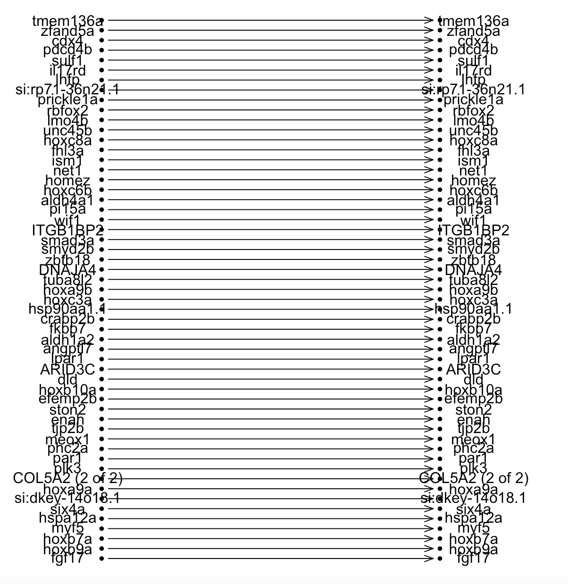

## Rank changes between Pearson's correlation and Euclidean distance

**The code below was modified based on a solution provided in a response on 'Stackoverflow' to the question:**
<p>
  <em>Simplest way to plot changes in ranking between two ordered lists in R?</em>
</p>

[Link to response can be found here](https://stackoverflow.com/questions/25781284/simplest-way-to-plot-changes-in-ranking-between-two-ordered-lists-in-r)

**My Code is Below**
```R
plotRanks <- function(a, b, labels.offset=0.1, arrow.len=0.1)
{
  old.par <- par(mar=c(1,1,1,1))
  
  # Find the length of the vectors
  len.1 <- length(a)
  len.2 <- length(b)
  
  # Plot two columns of equidistant points
  plot(rep(1, len.1), 1:len.1, pch=20, cex=0.8, 
       xlim=c(0, 3), ylim=c(0, max(len.1, len.2)),
       axes=F, xlab="", ylab="") # Remove axes and labels
  points(rep(2, len.2), 1:len.2, pch=20, cex=0.8)
  
  # Put labels next to each observation
  text(rep(1-labels.offset, len.1), 1:len.1, a)
  text(rep(2+labels.offset, len.2), 1:len.2, b)
  
  # Now we need to map where the elements of a are in b
  # We use the match function for this job
  a.to.b <- match(a, b)
  
  # Now we can draw arrows from the first column to the second
  arrows(rep(1.02, len.1), 1:len.1, rep(1.98, len.2), a.to.b, 
         length=arrow.len, angle=20)
  par(old.par)
}

par(mfrow=c(2,2))
getwd()
mydata_all <- read.csv(file='/Users/irismilligan/Documents/RScripts/output2.csv')
#plotRanks(c("a","b","c","d","e","f","g"),
#          c("b","x","e","c","z","d","a"))

plotRanks(mydata_all[,1], mydata_all[,2])
```

Results
<div> </div>
